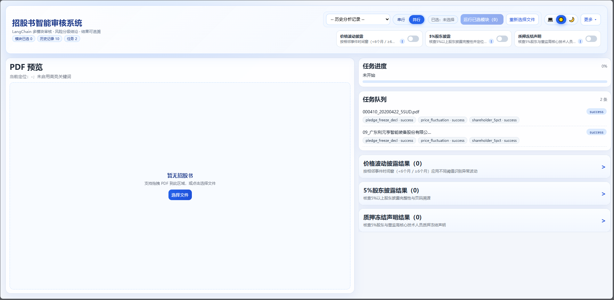
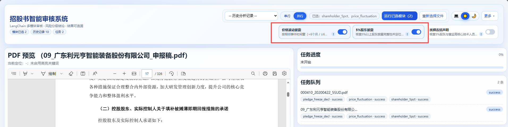
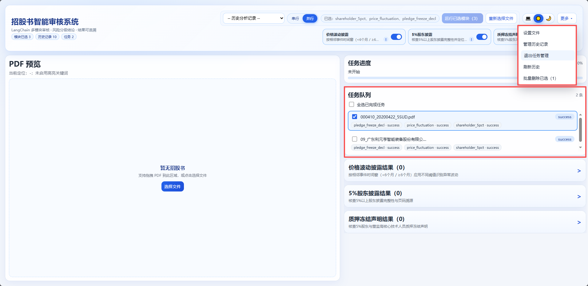
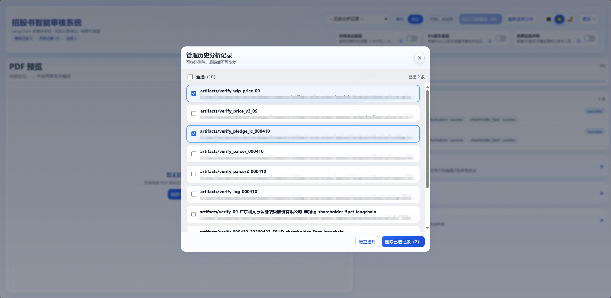
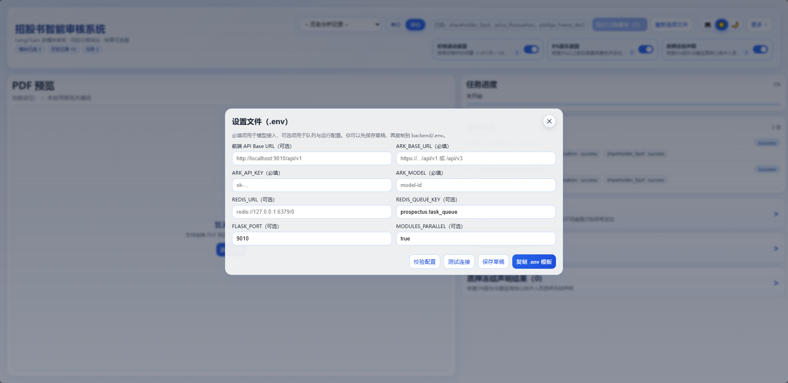
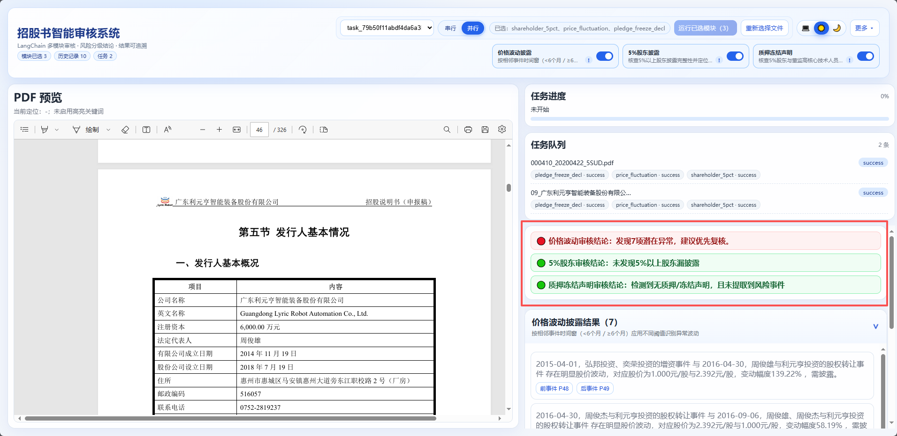
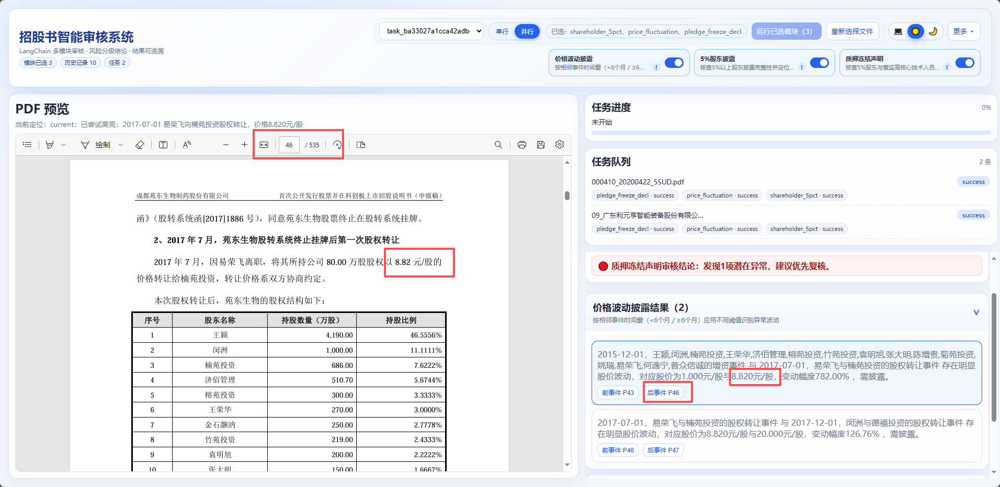
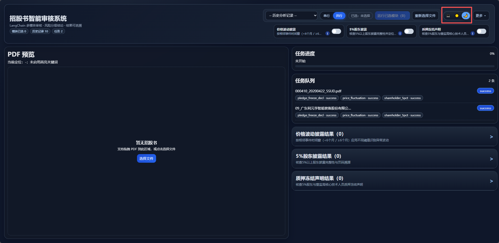

# Prospectus Intelligent Review System (LangChain Open-Source Minimal)

精简开源版（最小可运行集合）。

## 技术栈

- **后端框架**: Flask
- **LLM 编排**: LangChain 1.x
  - `langchain`
  - `langchain-core`
  - `langchain-openai`
  - `langchain-community`
- **结构化输出**: PydanticOutputParser + OutputFixingParser
- **文档解析**: pdfplumber（经 `PdfRouter` 封装）
- **前端框架**: Vue 3 + Vite + TypeScript
- **任务队列**: Redis（可选）+ 内存队列回退

## 后端技术说明

- API 层：Flask 提供任务创建、轮询、取消、结果查询与删除能力
- 任务执行：内置异步 worker，支持模块串行/并行执行
- 队列模式：
  - 优先使用 Redis（生产建议）
  - Redis 不可用时自动回退进程内队列
- LangChain 能力：
  - PromptTemplate 组织抽取提示词
  - PydanticOutputParser 约束结构化输出
  - OutputFixingParser 处理格式偏差
  - LCEL Runnable 链路组合抽取流程
- 规则护栏：对 LLM 抽取结果进行日期/价格/阈值等可审计规则判定

## 前端技术说明

- UI 框架：Vue 3（Composition API）
- 构建工具：Vite
- 语言：TypeScript
- 核心交互：
  - PDF 预览与告警联动定位
  - 任务队列管理（多选删除）
  - 历史记录管理弹窗（二次确认删除）
  - 设置文件弹窗（配置校验、连接测试、.env 模板复制）
  - 三态主题切换（系统/日间/夜间）

## 目录结构

```text
Prospectus_intelligent_review_system_langchain_open_source/
  backend/
    app/
      core/
      modules/
        shareholder_5pct/
        price_fluctuation_langchain/
        pledge_freeze_langchain/
      server.py
    requirements.txt
    .env.example
  frontend/
    src/
    package.json
    package-lock.json
    vite.config.ts
    index.html
  README.md
  .gitignore
```

## 快速启动

### 1) 启动后端

```bash
cd backend
python -m venv .venv
source .venv/bin/activate   # Windows: .venv\Scripts\activate
pip install -r requirements.txt
cp .env.example .env        # Windows: copy .env.example .env
python -m app.server
```

默认端口：`9010`

### 2) 启动前端

```bash
cd frontend
npm install
npm run dev
```

默认端口：`8432`

## 必要配置（backend/.env）

必填（模型）：

- `ARK_BASE_URL`
- `ARK_API_KEY`
- `ARK_MODEL`

可选：

- `REDIS_URL`
- `REDIS_QUEUE_KEY`（默认 `prospectus:task_queue`）
- `FLASK_PORT`（默认 `9010`）
- `MODULES_PARALLEL`（默认 `true`）

## 前端界面预览

### 01. 系统总览



### 02. 模块选择与运行控制



### 03. 任务队列管理（多选删除）



### 04. 历史分析记录管理弹窗



### 05. 设置文件弹窗（配置校验/连接测试）



### 06. 风险分级结论展示



### 07. PDF 联动定位



### 08. 夜间模式



## 说明

- 本版本仅保留运行必需文件，不包含本地测试产物与内部文档。
- 架构采用 **LangChain 抽取 + 本地规则判定**，兼顾语义能力与可审计性。
- 发布前请执行：`RELEASE_CHECKLIST.md`
